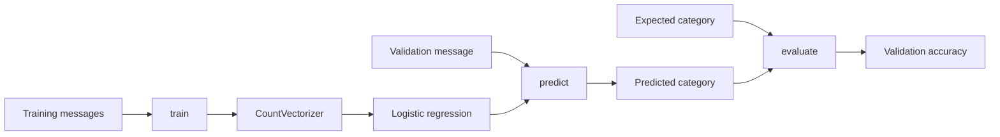
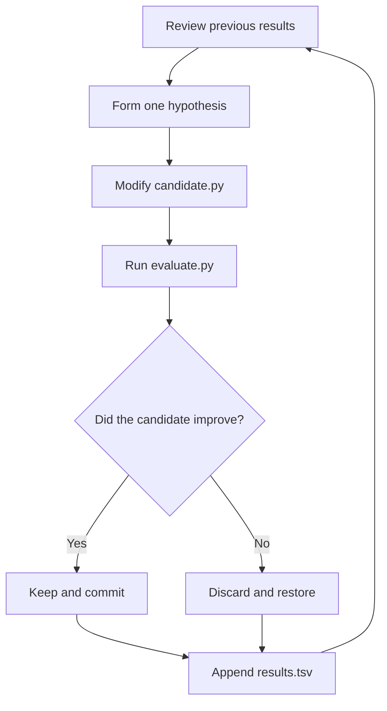

# Hypothesis Forge

> A small, explainable laboratory for eval-driven AI experimentation.

Hypothesis Forge demonstrates the core idea behind autonomous research systems: propose one
change, evaluate it against a fixed benchmark, and keep only evidence-backed improvements. The
project classifies operational messages as `incident`, `maintenance`, or `non_incident` using a
scikit-learn text pipeline.

Inspired by Andrej Karpathy's [autoresearch](https://github.com/karpathy/autoresearch), this version
is intentionally small enough to run locally and understand end to end.

## How it works



`CountVectorizer` converts text into word-count features. Logistic regression learns which
features are associated with each category. The evaluator then compares predictions with labels
that the model did not train on.

## Research loop



The fixed evaluator and datasets prevent the researcher from moving the goalposts. Git provides
checkpoints, while `results.tsv` preserves successful, discarded, and crashed experiments.

## Project structure

```text
hypothesis-forge/
├── candidate.py                 # Editable model under research
├── evaluate.py                  # Fixed validation evaluator
├── inspect_model.py             # Shows influential learned words
├── test_model.py                # Holdout evaluation runner
├── research.md                  # Guardrails for an AI researcher
├── results.tsv                  # Experiment history
├── requirements.txt             # Reproducible Python dependency
├── data/
│   ├── cases.json               # Training and validation examples
│   └── test_cases.json          # Holdout examples
├── docs/
│   └── learning-notes.md        # Concepts learned while building V1
└── examples/
    └── rule_based_candidate.py  # Original hand-written baseline
```

## Quick start

Requires Python 3.14 or a compatible Python 3 release.

```bash
python3 -m venv .venv
source .venv/bin/activate
python -m pip install -r requirements.txt
python evaluate.py
```

Inspect the words that most influence each category:

```bash
python inspect_model.py
```

Run the holdout evaluation only when making a final model assessment—not during iterative
research:

```bash
python test_model.py
```

## Dataset boundaries

| Split | Purpose | Used during research? |
| --- | --- | --- |
| Training | Fits model parameters | Yes |
| Validation | Scores candidate experiments | Yes |
| Holdout | Final generalization check | No |

The V1 dataset is synthetic and balanced by category. The holdout set is protected by convention:
`research.md` tells the AI researcher not to inspect or run it.

## Results

The initial keyword classifier scored 66.7% on benchmark V1. A TF-IDF and logistic-regression
candidate reached 100%, after which bounded agent experiments simplified the model without
reducing validation accuracy.

The final V1 candidate uses:

```text
English stop-word removal → word counts → logistic regression
```

Notable experiments are recorded in [`results.tsv`](results.tsv), including discarded ideas. A
discarded experiment is still useful because it records evidence about what did not improve the
candidate.

## AI researcher guardrails

The autonomous loop is deliberately constrained:

- Modify only `candidate.py` and append experiment results.
- Never change the evaluator or datasets.
- Never inspect the holdout test during research.
- Change one main idea per experiment.
- Keep only measurable improvements or meaningful simplifications.
- Stop after the requested experiment budget.

See [`research.md`](research.md) for the full research contract.

## What V1 teaches

- The difference between rules and learned behavior
- Training, validation, and holdout boundaries
- Bag-of-words feature extraction
- Multiclass logistic regression
- Model interpretability through learned feature weights
- Eval-driven keep/discard decisions
- Git as experiment memory and rollback
- Markdown instructions as an AI-agent research program

## Limitations

- The synthetic dataset is very small.
- Validation accuracy is saturated at 100%, so it cannot rank correct models precisely.
- Bag-of-words features do not deeply understand word order or context.
- The holdout set is protected by instructions rather than technical isolation.
- Human approval is still part of the agent loop.
- V1 does not enforce a fixed runtime budget.

## Next steps

- Expand the dataset with more diverse examples.
- Add cross-validation and probability-based log loss.
- Measure runtime and model size alongside accuracy.
- Parse and record experiment results automatically.
- Add automated tests and continuous integration.
- Explore a small neural model after establishing stronger baselines.
